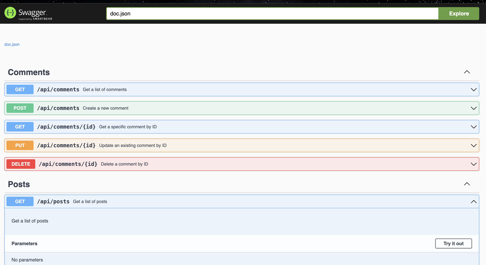

# Socials API

This is a simple Socials API built with Go (Gin) and SQLite.

## Project Structure

The project is organized into the following structure:
socials/
|-- docs/
|-- routes/
| |-- auth.go
| |-- posts.go
| |-- comments.go
| |-- users.go
| |-- router.go
|-- models/
| |-- user.go
| |-- post.go
| |-- comment.go
|-- utils/
| |-- hashing.go
|-- main.go
|-- social_media.db
|-- img/


## Getting Started

1. **Clone the repository:**

    ```bash
    git clone https://github.com/your-username/socials.git
    ```

2. **Install dependencies:**

    ```bash
    go get -u github.com/gin-gonic/gin
    go get -u github.com/mattn/go-sqlite3
    go get -u github.com/swaggo/swag/cmd/swag
    go get -u github.com/swaggo/gin-swagger
    go get -u github.com/swaggo/gin-swagger/swaggerFiles
    ```

3. **Generate Swagger documentation:**

    ```bash
    swag init -g routes/router.go -o docs
    ```

4. **Run the application:**

    ```bash
    go run main.go
    ```

    The API will be available at [http://localhost:8080](http://localhost:8080).

## API Documentation

Explore the API documentation using Swagger UI:

[http://localhost:8080/swagger/index.html](http://localhost:8080/swagger/index.html)

## Project Image




## Contributing

Feel free to contribute to this project by opening issues or submitting pull requests.

